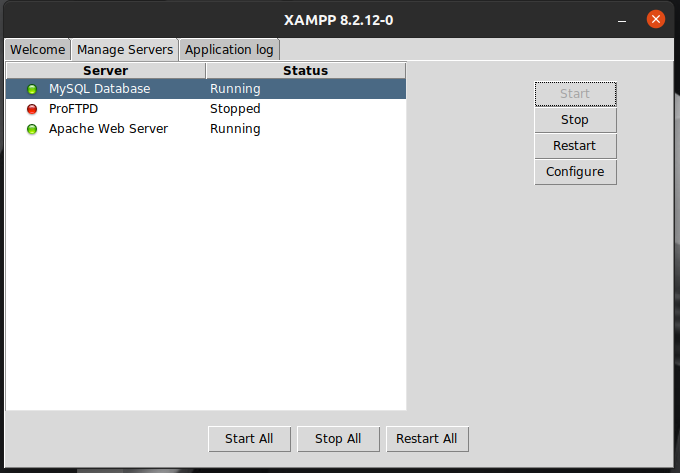

# WT-project

This is a simple web page created using HTML, CSS, PHP, JavaScript, and MySQLi as a part of our academic project.

## Features

- Responsive design
- Interactive user interface with Bootstrap
- Database integration with MySQLi
- Server-side scripting with PHP

## Technologies Used

- HTML
- CSS
- PHP
- JavaScript
- MySQLi
## Pre requirements
- You need to install XAMPP for ubuntu and JAM or any other server application for windows
- You need to complete the server setup as well as database setup.
- Make sure that you have your database login credentials.
- Start the server as well as database. Modify the `config.php` file by replacing the credentials with your credentials.
- Create a database and table named students
  ```bash
    CREATE TABLE students(
     id varchar(10) PRIMARY KEY,
     name varchar(50),
     gender varchar(10),
     dob DATE,
     phone BIGINT,
     email varchar(100),
     password varchar(100),
     year INT,
     section char(1));
  ```
- create another table named faculty as
  ```bash
    CREATE TABLE faculty(
     id varchar(10) PRIMARY KEY,
     name varchar(50),
     gender varchar(10),
     phone BIGINT,
     email varchar(100),
     password varchar(100),
     subject varchar(20));
  ```

## Installation

1.  Fork this repository
2.  Clone this repository:

    ```bash
    git clone https://github.com/ihemanthm/.git
    ```
    
3. Set up your local server environment (e.g., XAMPP, WAMP, MAMP).
   
4. Update the database configuration in `config.php` file.

5. Open the project in your web browser (place your files in /opt/lampp/htdocs if you are using ubuntu and open using localhost) .

## Screenshots




## Usage

1. Navigate to the project directory in your terminal.
2. Start your local server environment.
3. Open the project in your web browser.(ex: localhost/project/inde.html)
4. Explore the web page and interact with its features.

## Contributing

Contributions are welcome! Please follow these guidelines:

- Fork the repository
- Create a new branch (`git checkout -b feature`)
- Make your changes
- Commit your changes (`git commit -m 'Add new feature'`)
- Push to the branch (`git push origin feature`)
- Create a new Pull Request


